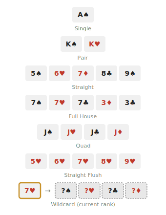

<div align="center">


[](https://www.typescriptlang.org/)
[](https://react.dev/)
[](https://nodejs.org/)
[](https://socket.io/)
[](LICENSE)

Online 掼蛋 (Guan Dan) card game. Create a room, invite friends, and play instantly in the browser.

[](https://eggbomb.duckdns.org)

</div>

## About 掼蛋 (Guan Dan)

掼蛋 is a 4-player team card game where partners race to shed cards before the opposing team. Valid combinations range from singles to multi-card bombs, with wildcards that can substitute any rank.

<div align="center">
  
</div>

## Features

**Gameplay**
- Full 掼蛋 rules (level progression 2-A, tribute system, wildcards, all hand types)
- Host-selectable starting level
- Dice roll for first player, with tie re-roll
- Hint button suggests the smallest valid play

**AI Bots**
- Information Set Monte Carlo Tree Search (ISMCTS) — handles hidden information (unknown opponent hands)
- Fills empty seats or can be added by the host
- Two difficulty levels: easy / medium
- Autopilot (托管) mode delegates your turn to the bot

**Multiplayer & Resilience**
- Real-time gameplay over WebSocket
- Disconnect/reconnect grace: 30s in-game window before entering autopilot
- PWA-installable on iOS / Android with home-screen icons

## Tech Stack

- **Frontend**: React + TypeScript + Vite, responsive layout optimized for both desktop and mobile
- **Backend**: Node.js + Express + Socket.io
- **Shared**: TypeScript types and game logic shared between client and server
- **Monorepo**: npm workspaces

## Project Structure

```
eggbomb/
├── client/      # React frontend (Vite)
├── server/      # Node.js game server
└── shared/      # Shared types and game logic
```

## Getting Started

**Prerequisites**: Node.js 18+

```bash
# Install all dependencies
npm install

# Start development (client + server + shared watch)
npm run dev
```

Client runs at `http://localhost:5173`, server at `http://localhost:3001`.

## Scripts

| Command | Description |
|---|---|
| `npm run dev` | Start everything in dev mode with hot reload |
| `npm run build` | Build all packages for production |
| `npm start` | Start the production server |

## Deployment

<details>
<summary>Single VPS with Nginx + PM2 (click to expand)</summary>

**1. Build**

```bash
# Set client env before building
echo "VITE_SERVER_URL=https://your-domain.com" > client/.env.production

npm run build
```

**2. Serve with PM2**

```bash
npm start   # or: pm2 start npm --name eggbomb -- start
```

**3. Nginx config (single domain)**

```nginx
server {
    listen 80;
    server_name your-domain.com;

    # Static frontend
    location / {
        root /path/to/eggbomb/client/dist;
        try_files $uri /index.html;
    }

    # WebSocket + API proxy
    location /socket.io/ {
        proxy_pass http://localhost:3001;
        proxy_http_version 1.1;
        proxy_set_header Upgrade $http_upgrade;
        proxy_set_header Connection "upgrade";
        proxy_set_header Host $host;
    }

    location /stats {
        proxy_pass http://localhost:3001;
    }
}
```

Add SSL with `certbot --nginx` for HTTPS.

</details>
